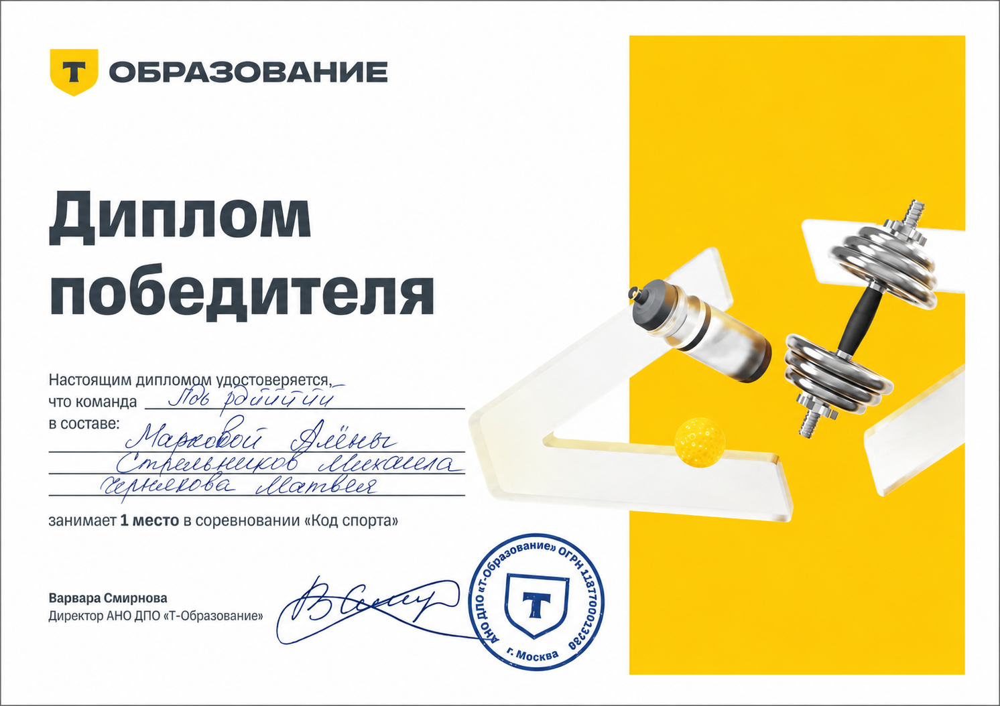
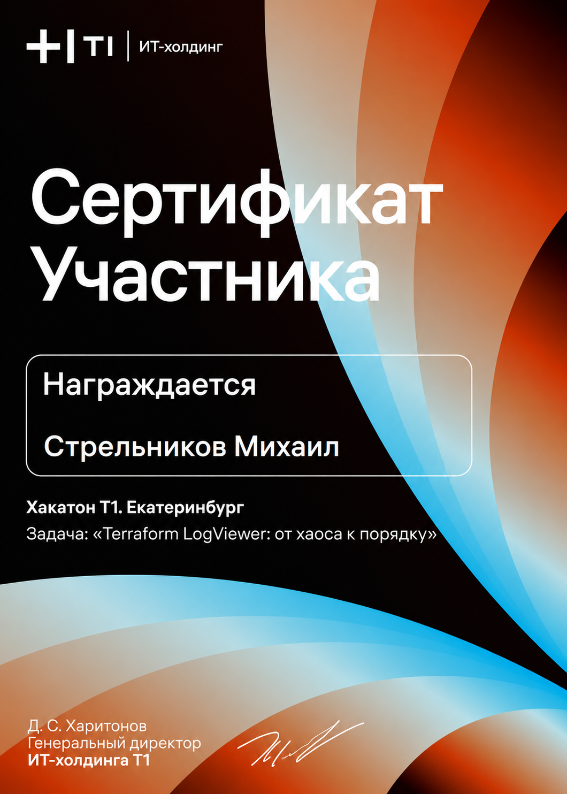
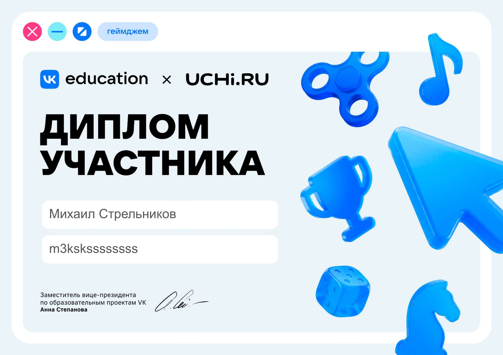
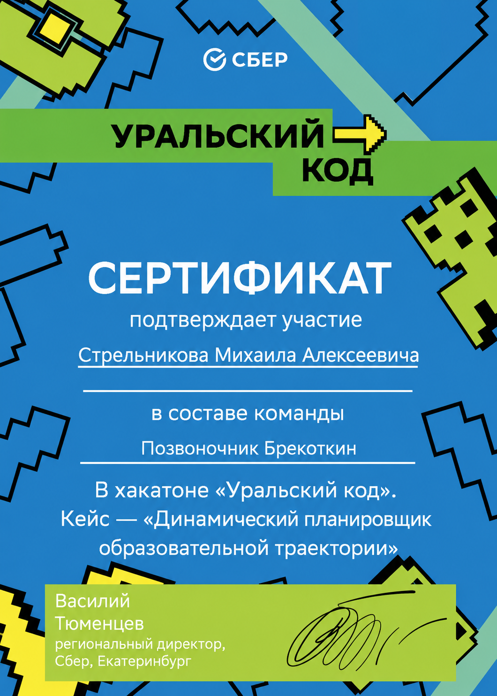
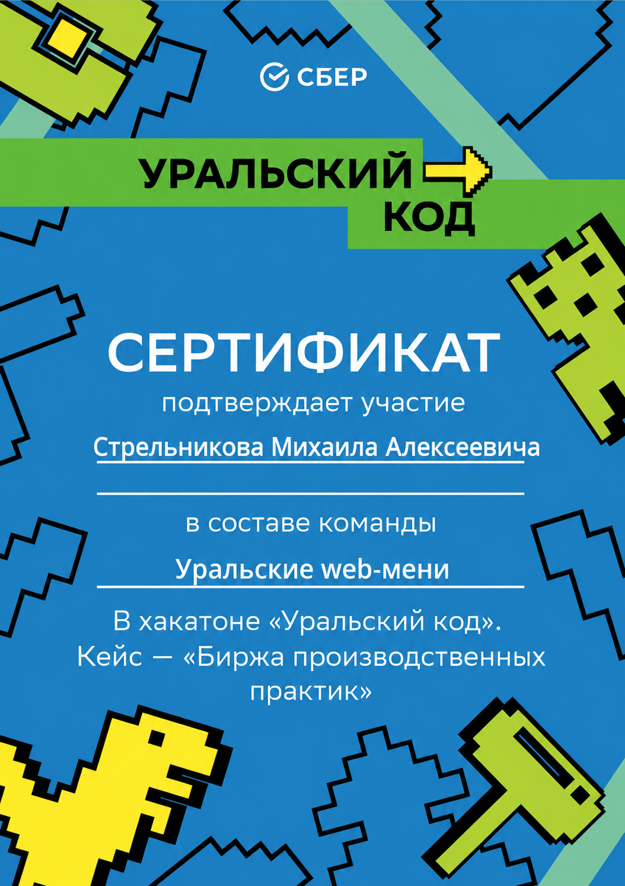
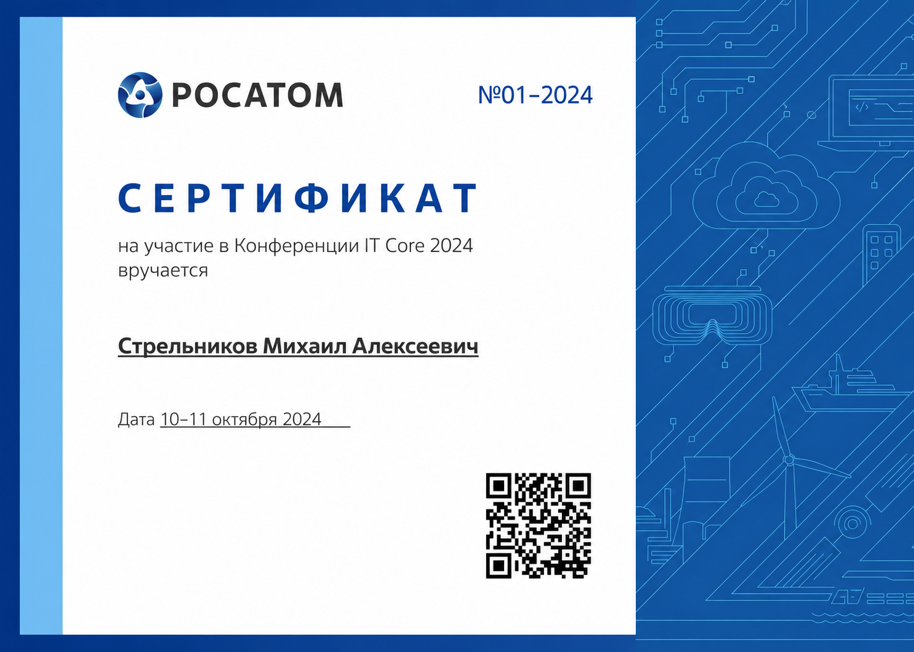

<h1 align="center">Стрельников Михаил Алексеевич</h1>
<h3 align="center">Fullstack / Frontend разработчик</h3>

  
  
  

---

## Сертификаты и награды

  
  
  
  
  
  

---

## О себе

Бакалавр Уральского федерального университета имени первого Президента России Б. Н. Ельцина по направлению «Информационные системы и технологии». Дополнительно прошёл программу профессиональной переподготовки, расширившую профиль компетенций.

С марта 2025 года занимал позицию backend-разработчика в ООО «Пи Эф Джи». Имею практический опыт создания и оптимизации веб-приложений, проектирования реляционных баз данных и разработки клиент-серверных решений.

Сфера профессиональных интересов — проектирование архитектуры программных систем, разработка пользовательских интерфейсов и работа с базами данных. Регулярно участвую в профильных хакатонах и IT-конференциях для поддержания актуальности практических навыков и расширения профессионального кругозора.

---

## Образование

**Уральский федеральный университет имени первого Президента России Б. Н. Ельцина**
Бакалавр по направлению «Информационные системы и технологии»
2022 — 2026

**Программа профессиональной переподготовки**
Документ установленного образца о дополнительной квалификации по направлению «Инженер микроконтроллеров на С++»
2024 — 2026

## Профессиональный опыт

**ООО «Пи Эф Джи»** — Backend-разработчик
Март 2025 — Апрель 2026

---

**Языки программирования**
 

 
**Frontend**
 

 
**Backend**
 

 
**Системы управления базами данных**
 

 
**Инструменты разработки и DevOps**
 

 
**API**
 

 
**Прикладное ПО и среда**
 

---

## Дополнительное образование

| Период | Курс | Учебное заведение |
|--------|------|-------------------|
| 2024 – 2025 | Проектирование и реализация баз данных | Университет ИТМО |
| 2023 – 2024 | Основы проектной деятельности | УрФУ |
| 2023 | Информационные технологии и сервисы | УрФУ |
| 2022 – 2023 | Информатика для ВТУЗов | Университет ИТМО |

---

## Участие в хакатонах и соревнованиях

| Дата | Мероприятие | Организатор | Результат |
|------|-------------|-------------|-----------|
| Май 2026 | GameJam VK × UCHI.RU | VK, Москва | Финалист |
| Март 2026 | «Код Спорта» | Т-Банк, Екатеринбург | **1 место** |
| Ноябрь 2025 | «Уральский код», кейс «Агрегатор образовательных курсов» | СберБанк, Екатеринбург | Участник |
| Октябрь 2025 | Хакатон Т1, кейс «Terraform LogViewer» | ИТ-холдинг Т1, Екатеринбург | Участник |
| Октябрь 2025 | Хакатон HH.ru, кейс «Интеллектуальный новостной агрегатор» | HH.ru / ЦАТ / Промтехдизайн, Санкт-Петербург | Участник |
| Октябрь 2024 | Конференция IT Core 2024 | Росатом, Нижний Новгород | Участник |
| Сентябрь 2024 | «Уральский код», кейс «Биржа производственных практик» | СберБанк, Екатеринбург | Участник |

---

## Ключевые компетенции

- Проектирование и разработка веб-приложений полного цикла
- Работа в составе команды разработки и проектное взаимодействие
- Аналитическое мышление и системный подход к решению задач
- Навыки делового устного и письменного общения
- Готовность к быстрому освоению новых технологий и инструментов

---

## Контактная информация

- **Электронная почта:** misha_2003_5@mail.ru
- **Telegram:** [@m3kskssssssss](https://t.me/m3kskssssssss)
- **VK:** [vk.com/m3kskssssssss](https://vk.com/m3kskssssssss)
- **Телефон:** +7 901 220 50 40
- **Местоположение:** Екатеринбург, Российская Федерация
